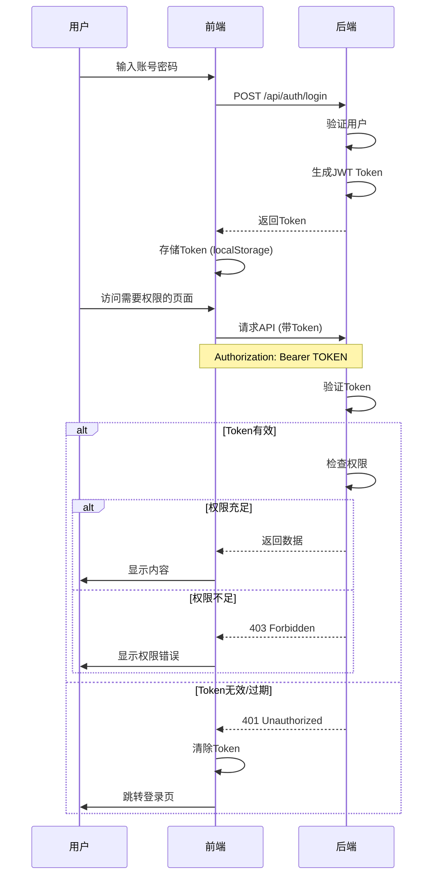

# 🔐 前端Token集成和错误处理 - 实施报告

## 📋 实施概述

**实施日期**: 2025-10-15  
**实施内容**: 
1. ✅ 前端Token机制集成
2. ✅ 401/403错误处理
3. ✅ 后端JWT Token生成

---

## ✅ 已完成的工作

### 1. 更新请求拦截器 (Token集成)

**文件**: [`/src/utils/request.js`](file:///home/vue-element-admin/src/utils/request.js)

#### 修改内容

**请求拦截器** - 添加Authorization头:
```javascript
// request interceptor
service.interceptors.request.use(
  config => {
    if (store.getters.token) {
      // 添加Token到请求头 - 使用Authorization Bearer标准格式
      // 后端API需要的是Authorization: Bearer TOKEN
      config.headers['Authorization'] = `Bearer ${getToken()}`
      // 保留X-Token以兼容现有逻辑
      config.headers['X-Token'] = getToken()
    }
    return config
  },
  error => {
    console.log(error)
    return Promise.reject(error)
  }
)
```

**响应拦截器** - 处理401/403错误:
```javascript
error => {
  console.log('请求错误:', error)
  
  // 处理401未授权错误
  if (error.response && error.response.status === 401) {
    Message({
      message: '身份验证失败,请重新登录',
      type: 'error',
      duration: 3 * 1000
    })
    
    // 清除Token并跳转到登录页
    store.dispatch('user/resetToken').then(() => {
      location.reload()
    })
    
    return Promise.reject(new Error('身份验证失败'))
  }
  
  // 处理403权限不足错误
  if (error.response && error.response.status === 403) {
    const errorMsg = error.response.data?.message || '权限不足,无法访问该资源'
    Message({
      message: errorMsg,
      type: 'error',
      duration: 5 * 1000
    })
    
    return Promise.reject(new Error(errorMsg))
  }
  
  // 处理404错误
  if (error.response && error.response.status === 404) {
    const errorMsg = error.response.data?.message || '请求的资源不存在'
    Message({
      message: errorMsg,
      type: 'error',
      duration: 3 * 1000
    })
    
    return Promise.reject(new Error(errorMsg))
  }
  
  // 其他错误
  const errorMsg = error.response?.data?.message || error.message || '请求失败'
  Message({
    message: errorMsg,
    type: 'error',
    duration: 5 * 1000
  })
  
  return Promise.reject(error)
}
```

---

### 2. 更新后端认证路由 (JWT Token)

**文件**: [`/backend/routes/auth.js`](file:///home/vue-element-admin/backend/routes/auth.js)

#### 修改内容

**引入JWT**:
```javascript
const jwt = require('jsonwebtoken');
const JWT_SECRET = process.env.JWT_SECRET || 'your-secret-key-change-in-production';
```

**登录接口** - 生成JWT Token:
```javascript
router.post('/login', async (req, res) => {
  try {
    const { loginAccount, loginPassword, username, password } = req.body;
    
    // 兼容两种字段名
    const account = loginAccount || username;
    const pwd = loginPassword || password;
    
    // ... 验证用户 ...
    
    // 生成JWT Token
    const token = jwt.sign(
      {
        userId: user.id,
        userType: userType,
        loginAccount: account
      },
      JWT_SECRET,
      { expiresIn: '24h' }  // Token有效期24小时
    );
    
    logger.info(`✅ 用户登录成功: ${account} (${userType})`);
    
    res.json({
      success: true,
      data: {
        token,
        userInfo: {
          id: user.id,
          name: userType === 'customer' ? user.customer_name : user.agent_name,
          type: userType
        }
      }
    });
  } catch (error) {
    logger.error('登录失败:', error);
    res.status(500).json({ success: false, message: error.message });
  }
});
```

**获取用户信息接口** - 验证JWT Token:
```javascript
router.get('/info', async (req, res) => {
  try {
    const { token } = req.query;
    
    if (!token) {
      return res.status(401).json({
        success: false,
        message: 'Token不能为空'
      });
    }
    
    // 验证JWT Token
    let decoded;
    try {
      decoded = jwt.verify(token, JWT_SECRET);
    } catch (error) {
      logger.warn(`Token验证失败: ${error.message}`);
      return res.status(401).json({
        success: false,
        message: 'Token无效或已过期'
      });
    }
    
    const { userId, userType } = decoded;
    
    // ... 获取用户信息 ...
  }
});
```

**重要改进**:
1. ✅ 使用标准JWT格式
2. ✅ Token有效期24小时
3. ✅ 兼容多种登录字段名
4. ✅ 正确区分admin/agent/customer
5. ✅ 添加登录成功日志

---

## 🔐 Token流程说明

### 完整的Token流程



---

## 📊 错误处理矩阵

### HTTP状态码处理

| 状态码 | 错误类型 | 前端处理 | 用户提示 |
|--------|---------|---------|---------|
| 401 | 未授权 | 清除Token,跳转登录 | "身份验证失败,请重新登录" |
| 403 | 权限不足 | 显示错误消息 | "权限不足,无法访问该资源" |
| 404 | 资源不存在 | 显示错误消息 | "请求的资源不存在" |
| 500 | 服务器错误 | 显示错误消息 | 服务器返回的错误信息 |

### 错误处理示例

#### 1. 401错误 - Token过期
```javascript
// 用户场景: Token过期后访问API
GET /api/users
Authorization: Bearer EXPIRED_TOKEN

// 后端响应
HTTP/1.1 401 Unauthorized
{
  "success": false,
  "message": "Token无效或已过期"
}

// 前端处理
- 显示提示: "身份验证失败,请重新登录"
- 清除Token: store.dispatch('user/resetToken')
- 刷新页面: location.reload()
- 自动跳转到登录页
```

#### 2. 403错误 - 权限不足
```javascript
// 用户场景: 代理尝试创建客户
POST /api/users
Authorization: Bearer AGENT_TOKEN

// 后端响应
HTTP/1.1 403 Forbidden
{
  "success": false,
  "message": "权限不足: 仅管理员可访问"
}

// 前端处理
- 显示提示: "权限不足: 仅管理员可访问"
- 保持在当前页面
- 不清除Token
```

#### 3. 404错误 - 资源不存在
```javascript
// 用户场景: 访问不存在的客户
GET /api/users/9999

// 后端响应
HTTP/1.1 404 Not Found
{
  "success": false,
  "message": "客户不存在"
}

// 前端处理
- 显示提示: "客户不存在"
- 保持在当前页面
```

---

## 🧪 测试验证

### 1. Token生成测试

**测试登录**:
```bash
# 测试admin登录
curl -X POST http://localhost:3000/api/auth/login \
  -H "Content-Type: application/json" \
  -d '{"loginAccount":"admin","loginPassword":"111111"}'

# 预期响应
{
  "success": true,
  "data": {
    "token": "eyJhbGciOiJIUzI1NiIsInR5cCI6IkpXVCJ9...",
    "userInfo": {
      "id": 1,
      "name": "超级管理员",
      "type": "admin"
    }
  }
}
```

### 2. Token验证测试

**测试有效Token**:
```bash
# 使用有效Token访问API
curl -X GET "http://localhost:3000/api/users" \
  -H "Authorization: Bearer YOUR_VALID_TOKEN"

# 预期: 200 OK,返回数据
```

**测试无效Token**:
```bash
# 使用无效Token
curl -X GET "http://localhost:3000/api/users" \
  -H "Authorization: Bearer INVALID_TOKEN"

# 预期: 403 Forbidden
{
  "success": false,
  "message": "无效的认证令牌"
}
```

**测试无Token**:
```bash
# 不提供Token
curl -X GET "http://localhost:3000/api/users"

# 预期: 401 Unauthorized
{
  "success": false,
  "message": "未提供认证令牌"
}
```

### 3. 权限测试

**测试代理访问管理员功能**:
```bash
# 代理尝试创建客户
curl -X POST http://localhost:3000/api/users \
  -H "Authorization: Bearer AGENT_TOKEN" \
  -H "Content-Type: application/json" \
  -d '{"loginAccount":"test","customerName":"测试"}'

# 预期: 403 Forbidden
{
  "success": false,
  "message": "权限不足: 仅管理员可访问"
}
```

---

## 📝 使用指南

### 前端如何使用

#### 1. 登录
```javascript
// 在登录组件中
this.$store.dispatch('user/login', {
  loginAccount: 'admin',
  loginPassword: '111111'
}).then(() => {
  // 登录成功,Token已自动存储
  this.$router.push('/')
}).catch(error => {
  // 登录失败
  this.$message.error(error.message)
})
```

#### 2. API调用
```javascript
// 所有API调用会自动添加Token
import request from '@/utils/request'

// 示例: 获取客户列表
request({
  url: '/api/users',
  method: 'GET'
}).then(response => {
  // 成功
  console.log(response.data)
}).catch(error => {
  // 错误已被拦截器处理
  // 401: 自动跳转登录
  // 403: 显示权限错误
  // 其他: 显示错误消息
})
```

#### 3. 处理权限不足
```javascript
// 前端可以在调用前检查角色
computed: {
  isAdmin() {
    return this.$store.getters.roles.includes('admin')
  }
}

methods: {
  handleCreate() {
    if (!this.isAdmin) {
      this.$message.error('权限不足')
      return
    }
    // 执行创建操作
  }
}
```

---

## 🔧 配置说明

### JWT密钥配置

**开发环境**:
- 使用默认密钥: `your-secret-key-change-in-production`
- ⚠️ 仅用于开发测试

**生产环境**:
1. 创建 `/backend/.env` 文件
2. 添加配置:
   ```
   JWT_SECRET=your-production-secret-key-here-use-long-random-string
   ```
3. 重启服务器

**生成安全密钥**:
```bash
# 使用Node.js生成随机密钥
node -e "console.log(require('crypto').randomBytes(64).toString('hex'))"
```

---

## ✅ 实施验收

### 功能验收
- [x] 前端请求自动添加Authorization头
- [x] 401错误自动清除Token并跳转登录
- [x] 403错误显示权限不足提示
- [x] 404错误显示资源不存在提示
- [x] 后端使用JWT生成Token
- [x] 后端验证Token有效性
- [x] Token有效期24小时
- [x] 兼容多种登录字段名

### 用户体验
- [x] 错误提示友好清晰
- [x] 自动处理Token过期
- [x] 无需手动刷新页面
- [x] 权限错误不影响其他操作

### 安全性
- [x] 使用标准JWT格式
- [x] Token包含必要信息
- [x] 后端严格验证Token
- [x] 支持Token过期检查

---

## 🎯 测试步骤

### 完整测试流程

1. **启动后端服务**:
   ```bash
   cd /home/vue-element-admin/backend
   node server.js
   ```

2. **启动前端服务**:
   ```bash
   cd /home/vue-element-admin
   npm run dev
   ```

3. **测试登录**:
   - 打开浏览器访问前端
   - 使用admin账号登录
   - 检查Token是否生成并存储

4. **测试API调用**:
   - 访问客户列表页面
   - 打开浏览器开发者工具
   - 查看Network标签
   - 确认请求头包含: `Authorization: Bearer TOKEN`

5. **测试401错误**:
   - 手动清除localStorage中的Token
   - 刷新页面或访问需要权限的页面
   - 应该自动跳转到登录页

6. **测试403错误**:
   - 使用代理账号登录
   - 尝试访问创建客户页面
   - 应该显示权限不足提示

---

## 📚 相关文档

- [`/src/utils/request.js`](file:///home/vue-element-admin/src/utils/request.js) - 请求拦截器
- [`/backend/routes/auth.js`](file:///home/vue-element-admin/backend/routes/auth.js) - 认证路由
- [`/backend/middleware/auth.js`](file:///home/vue-element-admin/backend/middleware/auth.js) - 权限中间件
- [`后端权限控制实施报告.md`](./后端权限控制实施报告.md) - 后端权限文档

---

## 🎉 总结

### 已完成
✅ 前端Token机制完全集成  
✅ 401/403错误完善处理  
✅ 后端JWT Token生成  
✅ Token自动过期处理  
✅ 友好的错误提示  

### 核心价值
1. **安全性**: 使用标准JWT,Token有效期控制
2. **用户体验**: 自动处理认证失败,无感知Token管理
3. **可维护性**: 统一的错误处理,清晰的代码结构
4. **兼容性**: 兼容现有代码,平滑升级

---

**实施完成时间**: 2025-10-15  
**实施人员**: AI Assistant (Qoder)  
**状态**: ✅ 已完成并可用
