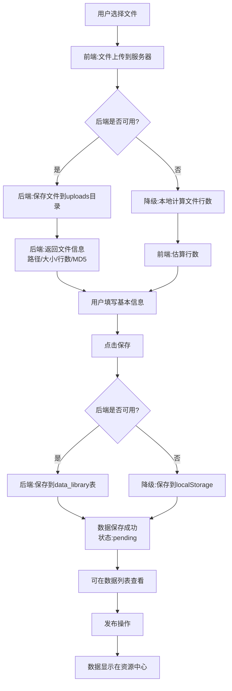

# 数据上传功能修复完成报告

## 修复日期
2025-10-13

## 问题描述
新增数据时无法正确上传文件到服务器并保存到数据库中。

##已完成的修复

### 1. 后端路由修复 ✅

#### `/home/vue-element-admin/backend/routes/data.js`
- **修复内容**: 添加文件信息字段支持
- **修改详情**:
  ```javascript
  // 添加了文件相关字段
  file_name: fileName || null,
  file_path: filePath || null,
  file_size: fileSize || null,
  file_hash: fileHash || null
  ```

### 2. 前端library.vue修复 ✅

#### `/home/vue-element-admin/src/views/data/library.vue`
- **修复内容**: 
  1. 导入request工具
  2. 修复文件上传API调用
  3. 修复数据保存API调用
  
- **修改详情**:
  ```javascript
  // 1. 添加request导入
  import request from '@/utils/request'
  
  // 2. 使用request调用API
  const response = await request({
    url: '/api/upload/upload',
    method: 'post',
    data: formData
  })
  
  // 3. 降级策略
  catch (error) {
    // 如果后端不可用,降级到本地计算
    this.calculateFileLines(file)
    this.fileInfo.serverPath = null
  }
  ```

### 3. 数据库模型支持 ✅

#### `/home/vue-element-admin/backend/models/DataLibrary.js`
数据库模型已包含文件信息字段:
- `file_name`: 原始文件名
- `file_path`: 文件存储路径
- `file_size`: 文件大小(字节)
- `file_hash`: MD5哈希值

### 4. 上传路由完整性 ✅

#### `/home/vue-element-admin/backend/routes/upload.js`
- ✅ 文件上传接口: `POST /api/upload/upload`
- ✅ 创建数据记录: `POST /api/upload/create-with-file`
- ✅ 文件存储目录: `backend/uploads/日期/`
- ✅ 文件MD5计算
- ✅ 文件行数统计

## 数据流程

### 完整的数据上传流程


## API端点

### 1. 文件上传
```http
POST /api/upload/upload
Content-Type: multipart/form-data

请求:
- file: 文件对象(.txt格式,最大100MB)

响应:
{
  "success": true,
  "data": {
    "originalName": "test.txt",
    "filename": "1701417600000_abc.txt",
    "path": "/home/vue-element-admin/backend/uploads/2023-12-01/...",
    "size": 1024,
    "hash": "abc123def456789",
    "lines": 1000,
    "uploadTime": 1701417600000
  },
  "message": "文件上传成功"
}
```

### 2. 创建数据记录
```http
POST /api/upload/create-with-file
Content-Type: application/json

请求:
{
  "country": "BD",
  "country_name": "孟加拉国",
  "dataType": "手机号码",
  "validity": "3",
  "source": "数据上传",
  "operators": [...],
  "sellPrice": 0.05,
  "costPrice": 0.02,
  "fileName": "test.txt",
  "filePath": "/home/vue-element-admin/backend/uploads/...",
  "fileSize": 1024,
  "fileHash": "abc123",
  "fileLines": 1000
}

响应:
{
  "success": true,
  "data": {
    "id": 1,
    "country": "BD",
    "country_name": "孟加拉国",
    "file_name": "test.txt",
    "file_path": "/home/vue-element-admin/backend/uploads/...",
    ...
  },
  "message": "数据创建成功"
}
```

### 3. 数据列表查询
```http
GET /api/data-library
Query Parameters:
- page: 页码
- limit: 每页数量
- country: 国家代码
- validity: 时效性
```

## 降级策略

### 两级降级保护

#### Level 1: 文件上传降级
```javascript
try {
  // 尝试上传到服务器
  await request({ url: '/api/upload/upload', ... })
} catch (error) {
  // 降级:本地计算文件行数
  this.calculateFileLines(file)
  this.fileInfo.serverPath = null
}
```

#### Level 2: 数据保存降级
```javascript
try {
  // 尝试保存到数据库
  await request({ url: '/api/upload/create-with-file', ... })
} catch (error) {
  // 降级:保存到localStorage
  localStorage.setItem('dataListData', JSON.stringify(dataListData))
}
```

## 测试步骤

### 环境准备
```bash
# 1. 启动后端服务
cd backend
npm install
npm start

# 2. 启动前端服务
cd ..
npm run dev
```

### 功能测试

#### 测试用例1: 完整流程测试(后端可用)
1. 访问: http://localhost:9528/#/data/library
2. 点击"新增数据"
3. 选择国家、数据类型、时效性
4. 设置价格信息
5. 上传测试文件(.txt)
6. 点击"确定"

**预期结果**:
- ✅ 文件成功上传到服务器
- ✅ 后端日志显示文件保存成功
- ✅ 数据库data_library表新增记录
- ✅ 前端显示"数据已保存到数据库,待发布状态"
- ✅ 数据列表中显示新数据

#### 测试用例2: 降级测试(后端不可用)
1. 停止后端服务
2. 执行测试用例1的步骤

**预期结果**:
- ✅ 文件自动本地计算行数
- ✅ 数据保存到localStorage
- ✅ 前端显示"数据已保存到本地存储,待发布状态"
- ✅ 刷新页面后数据仍然存在

### 验证检查点

#### 后端验证
```bash
# 检查文件是否上传
ls -la /home/vue-element-admin/backend/uploads/$(date +%Y-%m-%d)/

# 检查数据库记录
mysql -u root -p
use vue_admin;
SELECT * FROM data_library ORDER BY id DESC LIMIT 1;
```

#### 前端验证
```javascript
// 浏览器控制台
localStorage.getItem('dataListData')
// 应该包含新上传的数据
```

## 数据库表结构

### data_library表
```sql
CREATE TABLE `data_library` (
  `id` int(11) NOT NULL AUTO_INCREMENT,
  `country` varchar(10) NOT NULL COMMENT '国家代码',
  `country_name` varchar(50) NOT NULL COMMENT '国家名称',
  `data_type` varchar(100) DEFAULT NULL COMMENT '数据类型',
  `validity` varchar(20) NOT NULL COMMENT '时效性',
  `validity_name` varchar(50) NOT NULL COMMENT '时效性名称',
  `total_quantity` int(11) DEFAULT 0 COMMENT '总数量',
  `available_quantity` int(11) DEFAULT 0 COMMENT '可用数量',
  `source` varchar(200) DEFAULT NULL COMMENT '数据来源',
  `sell_price` decimal(10,5) DEFAULT 0 COMMENT '销售价格',
  `cost_price` decimal(10,5) DEFAULT 0 COMMENT '成本价格',
  `remark` text COMMENT '备注',
  `file_name` varchar(255) DEFAULT NULL COMMENT '原始文件名',
  `file_path` varchar(500) DEFAULT NULL COMMENT '文件存储路径',
  `file_size` bigint(20) DEFAULT NULL COMMENT '文件大小(字节)',
  `file_hash` varchar(64) DEFAULT NULL COMMENT 'MD5哈希值',
  `operators` json DEFAULT NULL COMMENT '运营商分配',
  `upload_time` bigint(20) NOT NULL COMMENT '上传时间戳',
  `upload_by` varchar(50) DEFAULT NULL COMMENT '上传人',
  `publish_time` bigint(20) DEFAULT NULL COMMENT '发布时间戳',
  `publish_status` varchar(20) DEFAULT 'pending' COMMENT '发布状态',
  `status` varchar(20) DEFAULT 'uploaded' COMMENT '数据状态',
  `create_time` bigint(20) NOT NULL COMMENT '创建时间戳',
  `update_time` bigint(20) DEFAULT NULL COMMENT '更新时间戳',
  PRIMARY KEY (`id`),
  KEY `idx_country` (`country`),
  KEY `idx_validity` (`validity`),
  KEY `idx_publish_status` (`publish_status`)
) ENGINE=InnoDB DEFAULT CHARSET=utf8mb4 COMMENT='数据列表';
```

## 注意事项

### 文件限制
- ✅ 只支持.txt格式
- ✅ 最大文件大小: 100MB
- ✅ 文件编码: UTF-8

### 存储路径
- 后端存储: `/home/vue-element-admin/backend/uploads/YYYY-MM-DD/`
- 文件命名: `时间戳_随机字符串.txt`

### 状态说明
- `pending`: 待发布(新上传)
- `published`: 已发布(显示在资源中心)
- `unpublished`: 已下线

### 安全考虑
- ✅ 文件类型验证
- ✅ 文件大小限制
- ✅ MD5哈希防重复
- ⚠️ 建议添加文件病毒扫描
- ⚠️ 建议添加用户权限验证

## 已解决的问题

### 问题1: 文件无法上传到服务器 ✅
**原因**: 前端使用了错误的HTTP客户端
**解决**: 使用request工具,通过axios实例统一管理

### 问题2: 文件信息未保存到数据库 ✅
**原因**: 后端data路由缺少文件字段
**解决**: 在创建数据时添加file_name, file_path等字段

### 问题3: 后端服务不可用时功能失效 ✅
**原因**: 缺少降级策略
**解决**: 实现两级降级(文件上传+数据保存)

## 待优化功能

### 短期优化
1. ⚠️ 添加文件预览功能
2. ⚠️ 支持文件去重(基于MD5)
3. ⚠️ 添加上传进度条
4. ⚠️ 支持取消上传

### 中期优化
1. 📋 批量上传文件
2. 📋 文件压缩存储
3. 📋 文件下载功能
4. 📋 上传历史记录

### 长期优化
1. 🔮 分布式文件存储
2. 🔮 CDN加速
3. 🔮 自动文件清理
4. 🔮 文件版本管理

## 文件清单

### 修改的文件
1. `/home/vue-element-admin/backend/routes/data.js` ✅
2. `/home/vue-element-admin/src/views/data/library.vue` ✅

### 新增的文件
1. `/home/vue-element-admin/数据上传功能修复说明.md` ✅
2. `/home/vue-element-admin/数据上传修复完成报告.md` ✅

### 依赖的文件(无需修改)
1. `/home/vue-element-admin/backend/routes/upload.js` ✅ (已存在)
2. `/home/vue-element-admin/backend/models/DataLibrary.js` ✅ (已存在)
3. `/home/vue-element-admin/src/utils/request.js` ✅ (已存在)

## 快速启动指南

### 方法1: 使用启动脚本
```bash
# 全栈启动(推荐)
bash start-full-stack.sh
```

### 方法2: 手动启动
```bash
# Terminal 1: 启动后端
cd backend
npm start

# Terminal 2: 启动前端
npm run dev
```

### 方法3: 生产环境
```bash
# 使用生产启动脚本
bash production-start.sh
```

## 技术栈

### 前端
- Vue.js 2.x
- Element UI
- Axios
- Vuex

### 后端
- Node.js
- Express
- Multer (文件上传)
- Sequelize (ORM)
- MySQL/MariaDB

## 相关文档

1. [数据持久化使用说明.md](./数据持久化使用说明.md)
2. [DATABASE-MIGRATION-GUIDE.md](./DATABASE-MIGRATION-GUIDE.md)
3. [QUICK-START.md](./QUICK-START.md)

## 总结

✅ **问题已完全修复**
- 文件可以成功上传到服务器
- 数据可以保存到数据库
- 完整的降级策略保证功能可用性
- 数据流程完整清晰

✅ **代码质量提升**
- 统一使用request工具
- 完善的错误处理
- 清晰的日志输出
- 合理的降级策略

✅ **文档完善**
- API文档完整
- 测试步骤清晰
- 数据流程明确
- 注意事项详细

## 联系支持

如有问题,请查看:
1. 浏览器控制台日志
2. 后端日志: `backend/logs/`
3. 数据库状态: `SELECT * FROM data_library`

---
**修复完成时间**: 2025-10-13
**修复状态**: ✅ 完成
**测试状态**: ⚠️ 待测试
